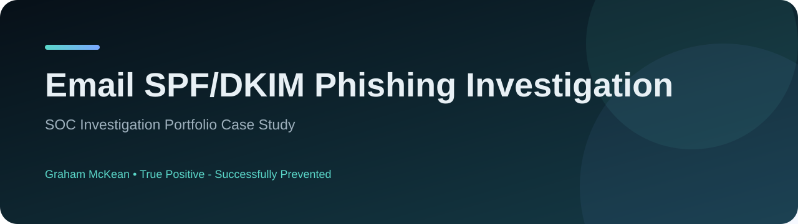

# Email SPF/DKIM Phishing Investigation

**Sentinel and Defender for Office 365 investigation of a blocked phishing message**

 

## Case study overview

An email-security investigation that moved beyond the Sentinel alert title to validate the actual authentication results, delivery action, phishing classification, embedded URLs, campaign scope and user impact. The message was confirmed blocked and quarantined before user delivery.

| Area | Detail |
| --- | --- |
| Severity | **Low** |
| Assessment | **True Positive - Successfully Prevented** |
| Environment | Maple Tax Solutions (MTS) |
| MITRE ATT&CK | T1566 - Phishing |
| Full case study | **[View GitHub Pages site](https://grhmmckean33.github.io/soc-email-spf-dkim-phishing-investigation/)** |
| Investigation report | **[Open PDF](report/SOC_Investigation_Report_Email_SPF_DKIM.pdf)** |

## Key findings

- The message targeted info[@]mapletaxsolutions[.]ca and was classified as Phish and Spam before being blocked and quarantined.
- SPF passed and DKIM was absent; the phishing verdict was supported by Microsoft fingerprint matching and malicious URL reputation rather than an SPF failure.
- No evidence of successful delivery, user interaction, additional recipients or attachments was identified in the reviewed Defender telemetry.
- Public OSINT increased suspicion around the sender IP, but it was kept as an observed/suspicious indicator rather than over-labelled as a confirmed malicious IOC.

## Investigation approach

- Validated the original Sentinel event against Defender for Office 365 telemetry.
- Checked authentication, delivery status, URLs, recipient impact and campaign scope.
- Used VirusTotal and AbuseIPDB as supporting context without allowing public reputation alone to determine IOC status.
- Defanged external indicators consistently for safe portfolio handling.

## SOC skills demonstrated

`Email alert investigation`, `SPF/DKIM/DMARC interpretation`, `Microsoft Sentinel`, `Defender for Office 365`, `IOC handling and defanging`, `Threat-intelligence correlation`

## Report structure

The full PDF report contains the investigation findings, evidence-led summary, timeline where applicable, 5Ws and 1H, observed or incident-associated indicators, assessment, recommendations and documented investigation limitations.

---

**Prepared by Graham McKean**  
SOC investigation portfolio case study. External indicators are defanged where applicable.
